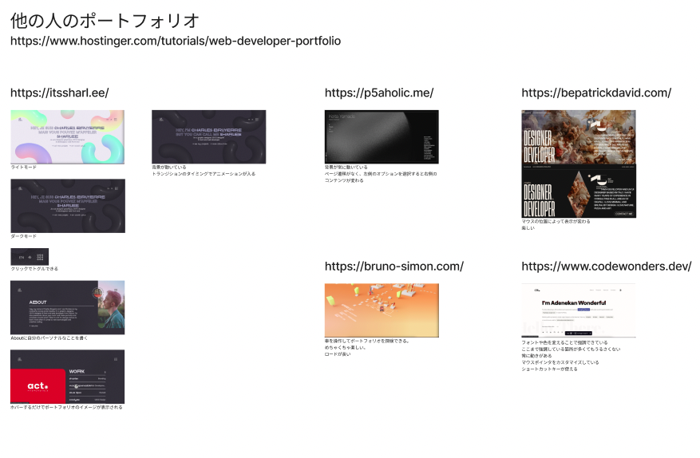
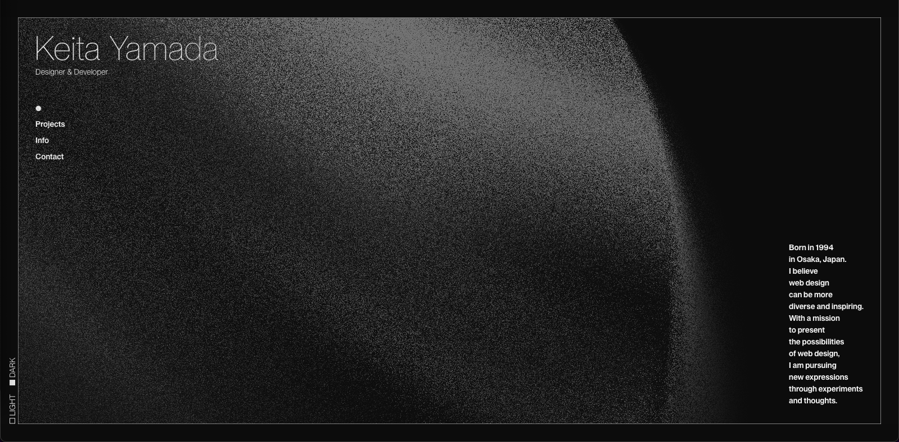
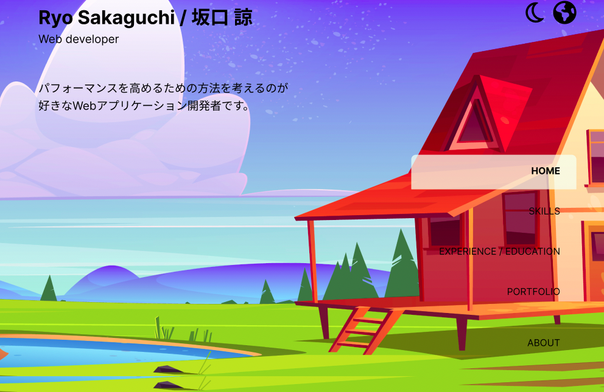

エンジニア採用担当の方に向けて、この自己紹介サイトを制作しました。

## 目的

目的は、成果物をもとに自分をアピールすることです。自分は実務経験に乏しいため、経歴でのアピールができませんでした。

またWebサイト制作を通じてフロントエンドの知識を身につけることも意識していました。

## 方法

Webサイト制作の流れは以下の通りです。

1. 勉強
2. デザイン
3. 技術選定
4. 開発

また開発工程では以下のような作業を行いました。

- 実装
- 細かい作業
    - テスト
    - CI/CDの設定
    - ドメインの取得
    - CDNの設定
    - SSL化
    - OGPタグ設定

以下では各工程の内容について述べたいと思います。

### 技術選定

#### 技術選定の基準

技術選定の第一の基準は「広く使われていること」です。そのような技術は就職先で活用できる可能性が高く、また独学でも不明点を解決しやすいと思うからです。

技術選定の第二の基準は「処理速度が速いこと」です。処理の重いサイトはユーザにストレスをかけてしまいます。また処理速度はエンジニアの技術力と強く相関すると思うため、採用担当者の方からの評価していただけると考えました。


#### 言語の選定

[TypeScript](https://www.typescriptlang.org/)を採用しました。

[Stackoverflowのサーベイ](https://survey.stackoverflow.co/2022/#most-popular-technologies-webframe-prof:~:text=48.07%25-,TypeScript,-34.83%25)によると、フロントエンドの言語として、TypeScriptはJavaScript, HTML/CSSに次ぐ3位の人気があり、広く使われています。処理速度に関しては、コンパイル後にJavaScriptになるため、JavaScriptと同じ速度だと考えられます。

また型チェックのあるTypeScriptを使うことで、JavaScriptを直接書くよりもバグを減らすことができます。IDEによる補完機能も充実しているため、開発体験も向上します。

処理速度の速いWebAssemblyを一部導入することも検討しました。しかしTypeScriptほど広く使われているわけではないうえ、重たい処理を行うわけではないので今回は採用しないこととしました。


#### フレームワークの選定

[Gatsby.js](https://www.gatsbyjs.com/)を採用しました。Gatsby.jsはReact.jsをベースとするStatic Site Generatorです。

[React.js](https://reactjs.org/)は[2022年現在、最も広く使われているユーザーインターフェース構築ライブラリ](https://survey.stackoverflow.co/2022/#most-popular-technologies-webframe:~:text=Node.js%20and%20React.js%20are%20the%20two%20most%20common%20web%20technologies%20used%20by%20Professional%20Developers)です。React.jsの強みはDOMの差分のみを更新することで効率よくページをレンダリングできることであり、これは第二の要件である「処理速度が速いこと」に直結します。

さらにGatsby.jsを使うことでページを事前にコンパイルできるので、サイトの読み込み速度を向上させることができます。

処理速度に強みのあるSvelte.jsも検討したのですが、まだ広く使われている段階ではなかったので今回は採用しないこととしました。


### 勉強

Webサイト制作の基礎から勉強しました。信頼できるドキュメントから体系的に学ぶことを心がけました。

-   [Learn Design with Figma](https://www.figma.com/resources/learn-design/)
-   [HTML elements reference - HTML: HyperText Markup Language | MDN](https://developer.mozilla.org/en-US/docs/Web/HTML/Element)
-   [JavaScript Guide - JavaScript | MDN](https://developer.mozilla.org/en-US/docs/Web/JavaScript/Guide)
-   [The TypeScript Handbook](https://www.typescriptlang.org/docs/handbook/intro.html)
-   [React.js MAIN CONCEPTS](https://reactjs.org/docs/hello-world.html)
-   [Tutorial | Gatsby](https://www.gatsbyjs.com/docs/tutorial/)


### デザイン

#### 方針決定

他の方のポートフォリオサイトを調査しました。特に[Keita Yamadaさんのサイト](https://p5aholic.me/)の名刺型のデザインは自己紹介にピッタリだと思い、採用することにしました。





また自分の個性として、自然を感じられる温かみのあるサイトを作ることを決めました。

#### デザイン制作

Figmaで以下のようなデザインを制作しました。




### 開発

#### 実装

実装の際に心掛けていたことは、**関数型コンポーネントを利用すること**です。クラス型コンポーネントよりも関心の分離が容易であるためです。

クラス型コンポーネントは`componentDidMount`や`componentDidUpdate`などのライフサイクルメソッドによってコードを書く必要があります。一方、関数型コンポーネントでは[Hooks](https://reactjs.org/docs/hooks-intro.html)でライフサイクルメソッドを置き換え、関心によってコードを分離することができるようになります。

また関数型コンポーネントではコードが短く書けます。メソッドをbindする必要もなく、コンストラクタも不要であるためです。

他に心掛けていたのは、**CSSには積極的にコメントを残すということ**です。CSSでは個々のプロパティの役割が不明確になりがちなので、コメントで補足したり、似たプロパティをまとめるなどの工夫をしました。

[本サイトのソースコード](https://github.com/dopenchills/self-introduction)はGithubで公開しています。


#### その他の作業

Github Actions上に**CI/CDパイプライン**を構築しました。main, stg, devの3つのブランチを作り、以下のように運用しました。

- stgにプッシュすると「単体テスト」と「Staging環境へのデプロイ」が走る
- Staging環境で動作を確認する
- mainにプルリクエストを出し、マージすると「本番環境へのデプロイ」が走る

また以下の作業も行いました。

- ドメインの取得
- CDNの設定
- SSL化
- OGPタグ設定


## 困難を感じたポイント

**CSSのデバッグ**に多くの時間をかけてしまいました。プロパティの変更などにより、思いもよらない場所に影響が出るためです。

今回の失敗をもとに、今後は以下のように改善したいと思います。

- CSSについて体系的に勉強し、バグの原因となるようなコードを書かないようにする
- 段階的に原因を特定するようにする
  - まずバグの原因となった**コミット**を特定する
  - 次にバグの原因となった**行**を特定する
  - 次にバグの**原因**を特定する

また[**PCとスマートフォンで異なる挙動となること**](https://w3reign.com/double-tapclick-issue-on-iosiphone-ipad-devices-solved/)を知らず、バグの原因特定に多くの時間をかけてしまいました。当時は自分のコードが原因なのか、一般的に起きている現象なのかを判断できませんでした。

今後は、バグの挙動を具体的に言語化して検索することで、一般的に起きている現象かどうかを早い段階で理解できるように心掛けたいと思います。


## アピールポイント

自然と温もりを感じてもらえるよう、スタイルを工夫しました。

- 緑と青を基調とした統一感のある色使い
- "優しい"スタイル
  - 丸みのあるコンポーネント
  - 背景に適用した`<feGaussianBlur>`タグ
- 穏やかなアニメーション
  - ゆっくり流れる雲
  - たまに映り込む葉っぱ
  - 穏やかな画面切り替え
  - 穏やかな押下アニメーション (ダークモード切り替えなど)

またアクセシビリティを向上させる工夫もしました。

- [Web Content Accessibility Guidelines (WCAG) 2](https://www.w3.org/TR/WCAG20/#:~:text=1.4.3%20Contrast%20(Minimum)%3A%20The%20visual%20presentation%20of%20text%20and%20images%20of%20text%20has%20a%20contrast%20ratio%20of%20at%20least%204.5%3A1%2C%20except%20for%20the%20following%3A%20(Level%20AA))をもとにした色選び
- ダークモードの導入

## 感想

改善点は多くあるものの、個人的には満足しています。見ていて穏やかな気持ちになれると思うためです。

CSSに関する知識不足が目立ったので、これからは体系的にCSSについて勉強していきたいと考えています。

また自分はバックエンドも扱えるということを示せるような作品も作りたいと思います。

## 追記

上に書いたこの方法は効果がありました。

> - 段階的に原因を特定するようにする
>   - まずバグの原因となった**コミット**を特定する
>   - 次にバグの原因となった**行**を特定する
>   - 次にバグの**原因**を特定する

バグの原因となったコミットを見つけてからバグを修正するまで、たった10分程度で行うことができました。以下にその概要を残したいと思います。

本サイトにはスクロールに関するバグがありました。

まずバグが再現できるコミットと、そうでないコミットを洗い出しました。

> バグなし  
> 1c18584 - (HEAD) Merge branch 'dev' into stg (2 days ago) <dopenchills>  
> e5739a7 - (HEAD) feat: add ssl (2 days ago) <dopenchills>  
> a961aab - (HEAD) fix: unstable behavior on tap device (2 days ago) <dopenchills>  
> 732aca5 - (HEAD) style: add my own favicon (2 days ago) <dopenchills>  
> 1a1f969 - (HEAD) fix: bug that there is no animation on ContentsContainer rerender (2 days ago)  
> d8eeda6 - (HEAD) fix: warning with clouds that did not have keys (2 days ago)  
> 6684d5b - fix: scrollToView unstable behavior (2 days ago) <dopenchills>  
>   
> バグあり  
> 2b530cd - (HEAD) feat: add falling leaves (28 hours ago) <dopenchills>  

以下のコマンドでバグ発生前後の差分を探しました。

```
git diff 1c18584..2b530cd
```

コード上の気になる箇所を修正し、Staging環境でバグが修正されていることを確認しました。

以上の経験から、闇雲に修正するよりも、コミットを絞り込んでいった方がいいことが実感できました。

またバグの発生箇所を特定するために、コミットの粒度を小さくし、コミットメッセージに意味をこめることの重要さを再確認しました。
